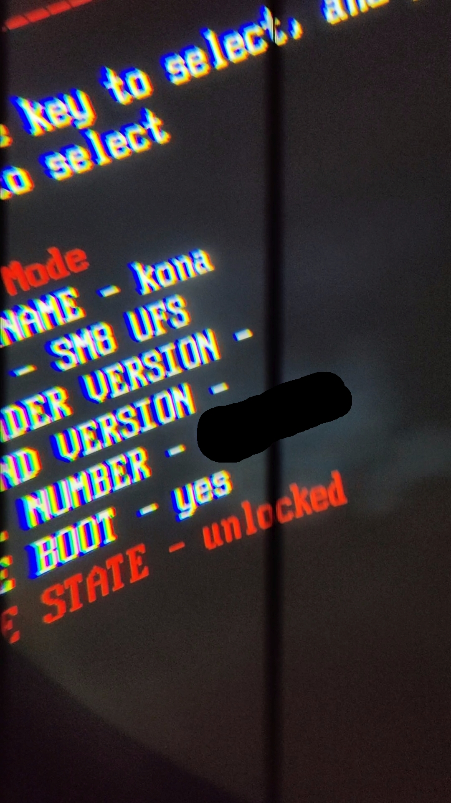
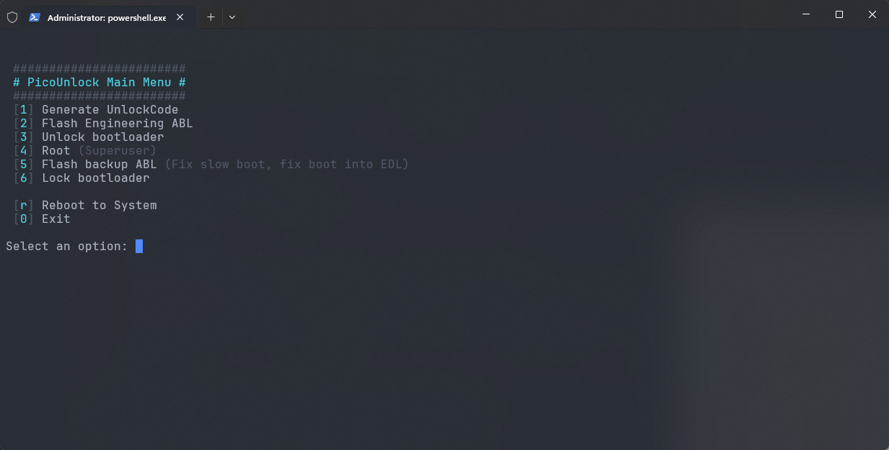

# Pico 3/4 Bootloader Unlock & Root Tool

 

This repository contains a comprehensive set of tools and scripts to unlock the bootloader and root the **Pico 4** (confirmed), **Pico 4 Pro** (confirmed), and **Pico Neo 3** VR headsets.

> [!CAUTION]
> **!!! DO A BACKUP FIRST WITH THE DOWNGRADER !!!**
> It is highly recommended to use the **Downgrader tool** to perform a **full LUN backup via EDL** before starting.
> Unlocking the bootloader **WILL WIPE ALL USER DATA**. Perform a backup before proceeding.

## Backup
Before starting the unlock process, it is **strongly advised** to use the **Downgrader tool** to create a full backup of all LUNs via EDL. This ensures you have a recovery path in case anything goes wrong during the partition flashing process.

## Status
*   **Pico 4**: Confirmed working.
*   **Pico 4 Pro**: Confirmed working.
*   **Pico Neo 3**: Not confirmed yet, but should work the same (uses ABL and devinfo from P3 firmware).

## Prerequisites
*   **Windows PC**: The automation script is written in PowerShell.
*   **Python**: Required for the unlock code generation logic (`more-picohaxx.py`).
*   **Qualcomm Drivers**: `QDLoader 9008` drivers. If not installed, use the provided script in `tools/qdl-driver/`.
*   **Pico Device**: Pico 4, Pico 4 Pro, or Pico Neo 3 with **USB Debugging** enabled.
*   **Backup**: Use the **Downgrader tool** to perform a **full LUN backup** (all partitions) via EDL before starting.

## ⚠️ WARNING
*   **Risk**: Flashing firmware carries inherent risks. While this method is tested, you proceed at your own risk.
*   **Engineering ABL & Devinfo**: The process involves flashing early engineering files. **Your Pico will not boot after flashing these** until the unlock process is complete. On Pico 4, this may result in SELinux being set to permissive.

## How It Works

1.  **Get Chip ID**: Acquire your `serial_number` (Chip ID) via `adb` (from `/sys/devices/soc0/serial_number`).
2.  **Generate Token**: Use `more-picohaxx.py` to generate your personal unlock command.
3.  **Flash Engineering Files**: Flash the old `abl` and `devinfo` via EDL.
    *   **Firehose Selection**: Choose the correct firehose based on your device hardware:
        *   **Pico 4 / Pico Neo 3**: Select **DDR 4** (Standard firehose).
        *   **Pico 4 Pro**: Select **DDR 5** (Lite firehose).
    *   **Note**: The device will be in a non-bootable state after this step until the process is completed.
4.  **Fastboot Unlock**: Issue the generated command from the script, followed by:
    *   `fastboot oem setenforce 0`
    *   `fastboot flashing unlock`
    *   `fastboot flashing unlock_critical`
5.  **Reboot Bootloader**: Check the status. If it isn't unlocked, **repeat the steps**. This is expected behavior; don't be afraid to try again.

## Rooting with Magisk

The tool includes an automated workflow to root your device:
1.  **Install Magisk APK**: The script installs `Magisk4Pico.apk` to your device.
2.  **Patch Boot Image**: You will be guided to download your current firmware, extract `boot.img`, and patch it using the Magisk app on the headset.
3.  **Flash Patched Image**: The script pulls the patched image back to your PC and flashes it via `fastboot`.

## Troubleshooting & Tips

### Unlock Persistence
If `fastboot oem device-info` shows the device as locked after the first attempt, **repeat the unlock commands**. It is known that the unlock bits (written to protected RPMB storage) might not "stick" immediately.

### Slow Boot or Automatic EDL Boot
Using the engineering ABL can cause issues like slow boot times or the device unexpectedly entering EDL mode. To fix this:
1.  **Unlock and Root** the device successfully first.
2.  Use the **"Flash backup ABL"** option in the script menu. This restores your original `abl` partition.
3.  Because the unlock state is stored in the **RPMB**, you will remain unlocked even with the original ABL.
4.  **Note**: This will return SELinux to `Enforcing`. Use a Magisk module (like `selinux_permissive`) to maintain permissive mode if your setup requires it.

### EDL Driver Installation
If the device is not detected in EDL mode (Qualcomm 9008):
*   Run the provided driver installation script: `.\tools\qdl-driver\install.ps1` as **Administrator**.
*   This will trust the certificate and install the WinUSB driver for the EDL device.

### USB Connectivity
*   Use a high-quality USB-C cable.
*   If EDL mode is unstable, try a **USB 2.0 port** or a USB 2.0 hub.
*   Manual EDL entry: Hold **Vol Up + Vol Down + Power** from a powered-off state.

## Key Components
*   `picounlock.ps1`: The main automation script (PowerShell).
*   `picounlock.bat`: A convenient wrapper to run the script with Administrator privileges.
*   `more-picohaxx.py`: The core logic for deriving the unlock code from the device serial number.
*   `devinfo`: Engineering partition data required for the bypass.
*   `tools/`: Contains `adb`, `fastboot`, and `qdl.exe` (for EDL flashing).
*   `Magisk4Pico.apk`: Included for rooting the device after unlocking.

## Credits
*   **@typlo**: For finding this bypass method and the previous root exploit.
*   **Fallen Angel**: Fearless testing and validation.

---
*For more technical details on the bypass mechanism, refer to the comments in `more-picohaxx.py`.*
